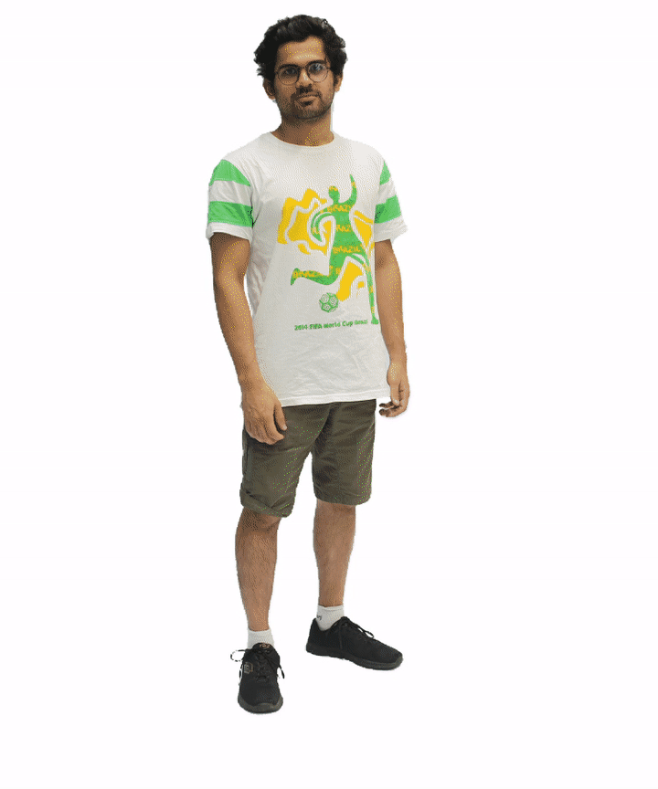

## CAPE: Clothed Auto-Person Encoding

[Paper](https://arxiv.org/abs/1907.13615) | [Project Page](https://cape.is.tue.mpg.de/)

Tensorflow (1.13) implementation of the CAPE model, a Mesh-CVAE with a mesh patch discriminator, for dressing SMPL bodies with pose-dependent clothing, introduced in the CVPR 2020 paper:

[Learning to Dress 3D People in Generative Clothing](https://arxiv.org/abs/1907.13615)



### Installation

We recommend creating a new virtual environment for a clean installation of the dependencies. The code has been tested on Ubuntu 18.04, python 3.6 and CUDA 10.0.

```bash
python3 -m venv $HOME/.virtualenvs/cape
source $HOME/.virtualenvs/cape/bin/activate
pip install -U pip setuptools
```

- Install [PSBody Mesh package](https://github.com/MPI-IS/mesh). Currently we recommend installing version 0.3.
- Install [smplx python package](https://github.com/vchoutas/smplx). Follow the installation instructions there, download and setup the SMPL body model.
- Then simply run `pip install -r requirements.txt` (do this at last to ensure `numpy==1.16.1`).

### Run demo code

Download the [checkpoint](https://drive.google.com/drive/folders/14KaTBkI9Qec1nb6qeDnLshu_8FzkzQsB?usp=sharing) and put this checkpoint folder under the `checkpoints` folder. Then run:

```bash
python main.py --config configs/config.yaml --mode demo --vis_demo 1 --smpl_model_folder <path to SMPL model folder>
```

It will generate a few clothed body meshes in the `results/` folder and show on-screen visualization.

### Training

We are currently working on making the new train / test splits corresponding to the public CAPE dataset\*, along with the data processing / loading script, and will update here soon.

\* The public release of the [CAPE dataset]((https://cape.is.tue.mpg.de/dataset)) slightly differs from what we used in the paper due to the removal of subjects that did not grant public release consent.

### Dataset

Check out our [project website](https://cape.is.tue.mpg.de/) for the new CAPE dataset, featuring approximately 150K dynamnic clothed human mesh registrations from real scan data, with consistent topology, making it an alternative to the popular Dynamic Faust dataset for 3D shape training and evaluation, and yet has more diverse shape deformations. 

### License

Software Copyright License for non-commercial scientific research purposes. Please read carefully the [terms and conditions](./LICENSE) and any accompanying documentation before you download and/or use the CAPE data and software, (the "Dataset & Software"), including 3D meshes, pose parameters, scripts, and animations. By downloading and/or using the Model & Software (including downloading, cloning, installing, and any other use of this github repository), you acknowledge that you have read these terms and conditions, understand them, and agree to be bound by them. If you do not agree with these terms and conditions, you must not download and/or use the Model & Software. Any infringement of the terms of this agreement will automatically terminate your rights under this [License](./LICENSE).

The SMPL body related files  `data/{template_mesh.obj, edges_smpl.npy}` are  subject to the license of the [SMPL model](https://smpl.is.tue.mpg.de/modellicense). The [PSBody mesh package](https://github.com/MPI-IS/mesh) and [smplx python package](https://github.com/vchoutas/smplx) are subject to their own licenses.

### Citing

If you find our code / paper / data useful to your research, please consider citing:

```bibtex
@inproceedings{CAPE:CVPR:20,
    title = {Learning to Dress 3D People in Generative Clothing},
    author = {Ma, Qianli and Yang, Jinlong and Ranjan, Anurag and Pujades, Sergi and Pons-Moll, Gerard and Tang, Siyu and Black, Michael J.},
    booktitle = {Computer Vision and Pattern Recognition (CVPR)},
    month = jun,
    year = {2020},
    month_numeric = {6}
}
```

The model and codes are based on [CoMA (ECCV18')](https://coma.is.tue.mpg.de/), a convolutional mesh autoencoder. If you find the code of this repository useful, please consider also citing:

```bibtex
 @inproceedings{COMA:ECCV18,
    title = {Generating {3D} faces using Convolutional Mesh Autoencoders},
    author = {Anurag Ranjan, Timo Bolkart, Soubhik Sanyal, and Michael J. Black},
    booktitle = {European Conference on Computer Vision (ECCV)},
    pages = {725--741},
    publisher = {Springer International Publishing},
    year = {2018},
	}
```